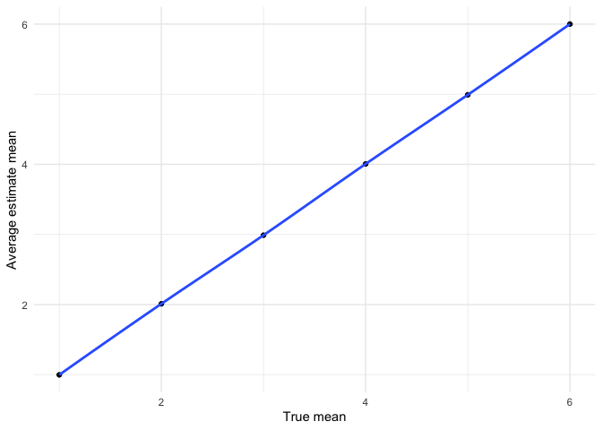
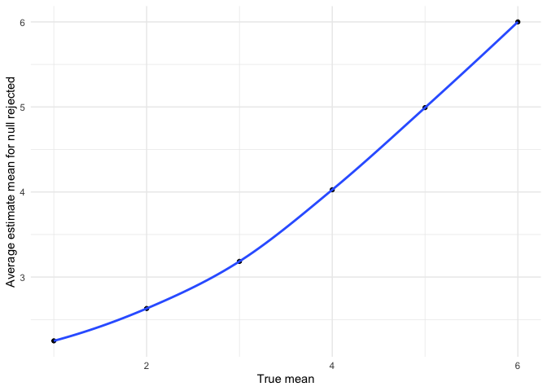

p8105_hw5_cn2604
================
Cary Ni
2022-11-04

# Problem 2

``` r
homi_df = read_csv("./data/homicide-data.csv") %>% 
  janitor::clean_names() %>% 
  mutate(
    city_state = paste(city, state, sep = ", "),
    outcome = case_when(
      disposition == 'Closed without arrest' ~ 'unsolved',
      disposition == 'Open/No arrest' ~ 'unsolved',
      disposition == 'Closed by arrest' ~ 'solved', 
      TRUE ~ 'unknown'
    )
  ) %>% 
  relocate(city_state, .after = state)
```

The raw dataframe has 12 variables and 52179 observations. It records
each of homicide cases across 51 cities in the US with a label of
results, which are ‘Closed without arrest’, ‘Open/No arrest’, and
‘Closed by arrest’.

Baltimore as a sample

``` r
baltimore_summary = homi_df %>% 
  filter(city_state == 'Baltimore, MD') %>% 
  summarise(
    unsolved = sum(outcome == 'unsolved'),
    number = n()
  ) %>% 
  add_column(city_name = 'Baltimore, MD')

baltimore_test = prop.test(
  x = pull(baltimore_summary, unsolved),
  n = pull(baltimore_summary, number)
) 

baltimore_result = baltimore_test %>% 
  broom::tidy() %>% 
  select(estimate, conf.low, conf.high) %>% 
  mutate(
    city = pull(baltimore_summary, city_name)
  ) %>% 
  relocate(city)
```

Create the function

``` r
prop_function = function(sample_df){
  sample_summary = sample_df %>% 
  summarise(
    unsolved = sum(outcome == 'unsolved'),
    number = n()
  )
  
  sample_test = 
    prop.test(
      x = pull(sample_summary, unsolved),
      n = pull(sample_summary, number)
    ) %>% 
    broom::tidy() %>% 
    select(estimate, conf.low, conf.high)
  
  sample_test
}
```

Pass cities to the function

``` r
homi_data = 
  homi_df %>% 
  group_by(city_state) %>% 
  nest() %>% 
  mutate(
    city_result = map(data, prop_function)
  ) %>% 
  unnest(city_result) %>% 
  select(-data)

homi_data %>% 
  head() %>% 
  knitr::kable()
```

| city_state      |  estimate |  conf.low | conf.high |
|:----------------|----------:|----------:|----------:|
| Albuquerque, NM | 0.3862434 | 0.3372604 | 0.4375766 |
| Atlanta, GA     | 0.3833505 | 0.3528119 | 0.4148219 |
| Baltimore, MD   | 0.6455607 | 0.6275625 | 0.6631599 |
| Baton Rouge, LA | 0.4622642 | 0.4141987 | 0.5110240 |
| Birmingham, AL  | 0.4337500 | 0.3991889 | 0.4689557 |
| Boston, MA      | 0.5048860 | 0.4646219 | 0.5450881 |

Create plots

``` r
homi_data %>% 
  filter(city_state != "Tulsa, AL") %>% 
  ggplot(aes(x = reorder(city_state,-estimate), y = estimate)) + 
  geom_bar(stat="identity") +
  geom_errorbar(aes(ymin = conf.low, ymax = conf.high)) +
  theme(axis.text.x = element_text(angle = 90, vjust = 0.5, hjust=1)) +
  labs(
    title = "Proportion of unsolved homicides by cities",
    x = "City",
    y = "Estimate proportion",
    caption = "Data from The Washington Post")
```

<!-- --> \#
Problem 3

``` r
output_list_0 = vector("list", length = 5000)
for (i in 1:5000) {
  output_list_0[[i]] = rnorm(30, 0, 5)
}
output_test_0 = map(.x = output_list_0, ~ t.test(.x, mu=0))
output_df_0 = 
  tibble(
    true_mean = "0",
    result = map(output_test_0, broom::tidy)
  ) %>% 
  unnest(result) %>% 
  select(true_mean, estimate, p.value)
```

``` r
design_func = function(mean_input) {
  output_list = vector("list", length = 5000)
  for (i in 1:5000) {
    output_list[[i]] = rnorm(30, mean_input, 5)
  }
  output_test = map(.x = output_list, ~ t.test(.x, mu=0))
  output_df = 
  tibble(
    true_mean = as.character(mean_input),
    result = map(output_test, broom::tidy)
  ) %>% 
  unnest(result) %>% 
  select(true_mean, estimate, p.value)
  
  output_df
}
```

``` r
test_mean = c(1, 2, 3, 4, 5, 6)
result_df = map_dfr(test_mean, design_func)
```

``` r
result_summary = 
  result_df %>% 
  group_by(true_mean) %>% 
  summarise(
    ave_estimate = mean(estimate), 
    prop_reject = sum(p.value < 0.05)/n()
  ) %>% 
  mutate(true_mean = as.numeric(true_mean)) 
```

``` r
result_summary %>% 
  ggplot(aes(x=true_mean, y=prop_reject)) +
  geom_point() +
  geom_smooth() +
  labs(
    x = "True mean",
    y = "Proportion of null rejection"
    )
```

    ## `geom_smooth()` using method = 'loess' and formula 'y ~ x'

<!-- -->

As the effect sizes increase, the statistical power will also increase.

``` r
result_summary %>% 
  ggplot(aes(x=true_mean, y=ave_estimate)) +
  geom_point() +
  geom_smooth() +
  labs(
    x = "True mean",
    y = "Average estimate mean"
    )
```

<!-- -->

``` r
result_df %>% 
  filter(p.value < 0.05) %>% 
  group_by(true_mean) %>% 
  summarise(
    ave_estimate = mean(estimate)
  ) %>% 
  mutate(true_mean = as.numeric(true_mean)) %>% 
  ggplot(aes(x=true_mean, y=ave_estimate)) +
  geom_point() +
  geom_smooth() +
  labs(
    x = "True mean",
    y = "Average estimate mean for null rejected"
    )
```

<!-- -->

For the sample with true mean μ = 1, 2, 3, the sample average of μ hat
across tests for which the null is rejected are higher than their true
means since the μ closer to μ=0 are excluded from the calculation for
failure of rejection. For true mean μ = 4, 5, 6, the sample average of μ
hat across tests for which the null is rejected are approximately equal
to their true means because there is few sample closer to μ=0 are
excluded from the calculation since the probability to failure of
rejection is too low for μ = 4, 5, 6.
