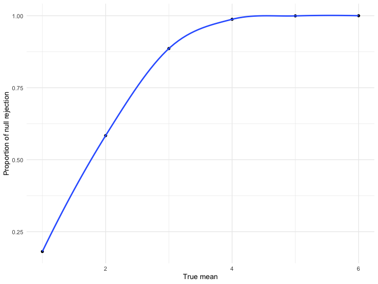

p8105_hw5_cn2604
================
Cary Ni
2022-11-04

# Problem 2

``` r
homi_df = read_csv("./data/homicide-data.csv") %>% 
  janitor::clean_names() %>% 
  mutate(
    city_state = paste(city, state, sep = ", "),
    outcome = case_when(
      disposition == 'Closed without arrest' ~ 'unsolved',
      disposition == 'Open/No arrest' ~ 'unsolved',
      disposition == 'Closed by arrest' ~ 'solved', 
      TRUE ~ 'unknown'
    )
  ) %>% 
  relocate(city_state, .after = state)
```

The raw dataframe has 12 variables and 52179 observations. It records
each of homicide cases across 51 cities in the US with a label of
results, which are ‘Closed without arrest’, ‘Open/No arrest’, and
‘Closed by arrest’.

Baltimore as a sample

``` r
baltimore_summary = homi_df %>% 
  filter(city_state == 'Baltimore, MD') %>% 
  summarise(
    unsolved = sum(outcome == 'unsolved'),
    number = n()
  ) %>% 
  add_column(city_name = 'Baltimore, MD')

baltimore_test = prop.test(
  x = pull(baltimore_summary, unsolved),
  n = pull(baltimore_summary, number)
) 

baltimore_result = baltimore_test %>% 
  broom::tidy() %>% 
  select(estimate, conf.low, conf.high) %>% 
  mutate(
    city = pull(baltimore_summary, city_name)
  ) %>% 
  relocate(city)
```

Create the function

``` r
prop_function = function(sample_df){
  sample_summary = sample_df %>% 
  summarise(
    unsolved = sum(outcome == 'unsolved'),
    number = n()
  )
  
  sample_test = 
    prop.test(
      x = pull(sample_summary, unsolved),
      n = pull(sample_summary, number)
    ) %>% 
    broom::tidy() %>% 
    select(estimate, conf.low, conf.high)
  
  sample_test
}
```

Pass cities to the function

``` r
homi_data = 
  homi_df %>% 
  group_by(city_state) %>% 
  nest() %>% 
  mutate(
    city_result = map(data, prop_function)
  ) %>% 
  unnest(city_result) %>% 
  select(-data)

homi_data %>% 
  head() %>% 
  knitr::kable()
```

| city_state      |  estimate |  conf.low | conf.high |
|:----------------|----------:|----------:|----------:|
| Albuquerque, NM | 0.3862434 | 0.3372604 | 0.4375766 |
| Atlanta, GA     | 0.3833505 | 0.3528119 | 0.4148219 |
| Baltimore, MD   | 0.6455607 | 0.6275625 | 0.6631599 |
| Baton Rouge, LA | 0.4622642 | 0.4141987 | 0.5110240 |
| Birmingham, AL  | 0.4337500 | 0.3991889 | 0.4689557 |
| Boston, MA      | 0.5048860 | 0.4646219 | 0.5450881 |

``` r
homi_data %>% 
  filter(city_state != "Tulsa, AL") %>% 
  ggplot(aes(x = reorder(city_state,-estimate), y = estimate)) + 
  geom_bar(stat="identity") +
  geom_errorbar(aes(ymin = conf.low, ymax = conf.high)) +
  theme(axis.text.x = element_text(angle = 90, vjust = 0.5, hjust=1)) +
  labs(
    title = "Proportion of unsolved homicides by cities",
    x = "City",
    y = "Estimate proportion",
    caption = "Data from The Washington Post")
```

<!-- -->
